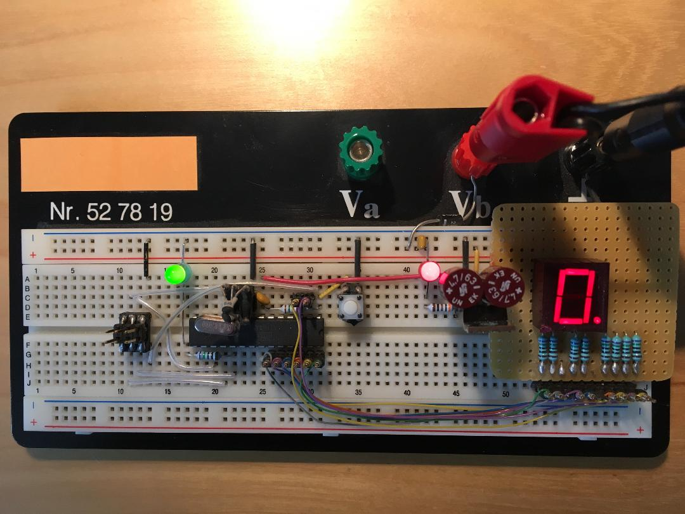

# Example Chapter09_07
# Controlling a Seven Segment Display

Example chapter09_07 makes use of object oriented
programming methods to control a seven segment display.

# Controlling the Display

In this example, port pins are used to control a
seven segment single-character display. As in most other examples,
both a hardware version for the target system as well as a simlulated
PC version are available. The PC version writes its
character to the output console.

# Application Description

The sixteen hexadecimal digits 
are displayed sequentially, one digit per second.
The dot (_i_._e_., period or decimal point) is toggled
on and off for successive groups of 16 hexadecimal digits.
The user LED is simultaneously toggled at the usual 1/2Hz.

The application task is intuitive and easy to understand.
The followind code snippet from the application task
`app::display::task_func`, for instance, depicts the control
responsible for writing the character digit and decimal
point on the seven segment display. The user LED is simultaneously
toggled at its frequency of 1/2Hz.

```
void app::display::task_func()
{
  if(app_display_timer.timeout())
  {
    app_display_timer.start_interval(timer_type::seconds(1U));

    // Toggle the user LED at 1/2Hz.
    mcal::led::led0.toggle();

    // The index runs from 0...F and is used to express
    // the character that is to be written on the display.
    ++app_display_index;

    if(app_display_index >= UINT8_C(0x10))
    {
      app_display_index = UINT8_C(0);

      // Toggle the decimal point for each successive
      // group of 16 hexadecimal digits.
      app_display_dp_on = (!app_display_dp_on);
    }

    // Write the decimal point.
    mcal::display::display0().write_dp(app_display_dp_on);

    // Write the character 0...F.
    mcal::display::display0().write(app_display_index);
  }
}
```

Object oriented design with several layers of abstraction
allows for a clean separation between hardware dependencies
and the application layer code. This makes it possible
to run the same application code on both the PC as well
as the embedded target. These kinds of methods exemplify
how useful cross development can be for writing error-free,
portable application layer code.


# Hardware Setup

The hardware setup is pictured in the image below.


