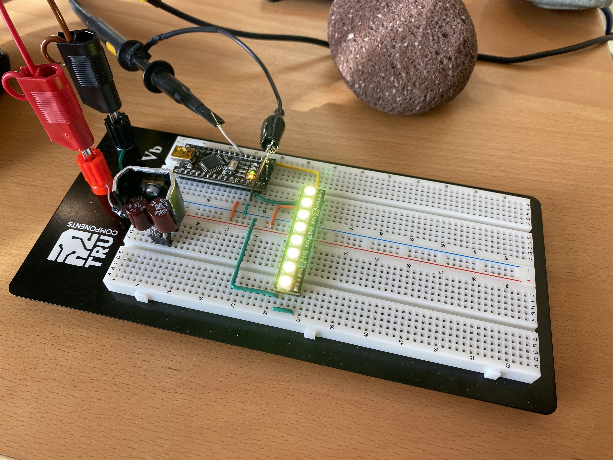
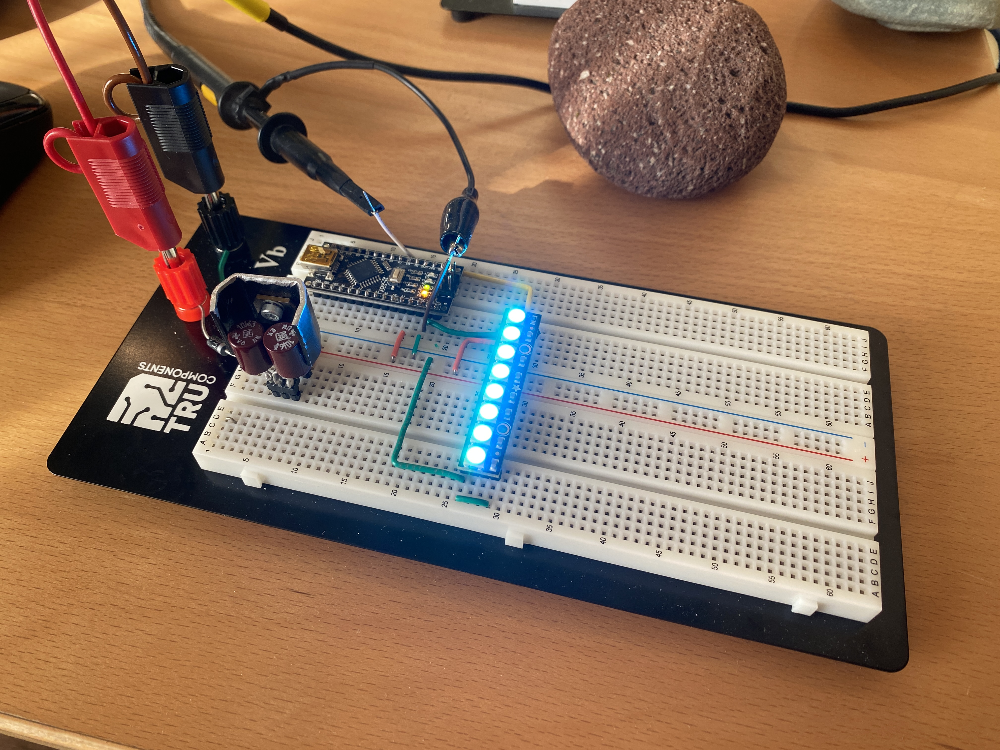
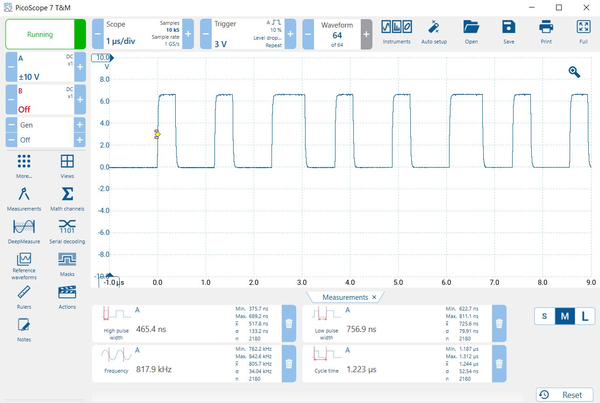

# Example Chapter09_08a
## Controlling an RGB LED of type ws2812

Example chapter09_08a utilizes object oriented programming techniques
to control a sequential chain of eight industry-standard RGB LEDs of type ws2812

This example controls an RGB LED using programming techniques similar to those used in the previous example.
There are, however, several differences such as the refactored, modernized LED-class hierarchy.
The main difference, however, is that a _digitally_-controlled industry-standard
RGB LED of type ws2812 is used. In addition, the color transitions at (and around) $255~\text{bits}$-RGB
are slowed down providing emphasized, longer-lasting RGB hues near these points.

## Controlling the ws2812

The ws2812 RGB LED is controlled by a very specifically timed,
novel digital signal. In this signal, each of the $24$ RGB
color bits is set to the value $1$ or $0$ depending on the
half-width of a low/high signal pair.

In this example (as in most other examples), both a hardware
version for the target system as well as a simlulated PC
version are available. For this exercise, it was
decided to implement a rather detailed PC simulation
using old-school traditional Win32-API programming.

## Application Description

Strikingly bright, vibrant hues of RGB blend in a smooth fashion around the entire
spectrum to produce the appearance of evenly varying colors.

The user LED is simultaneously toggled at the usual $\frac{1}{2}~\text{Hz}$.

The `led_rgb_ws2812` template class can be found in its entirety in the file
[`mcal_led_rgb_ws2812.h`](./src/mcal/avr/mcal_led_rgb_ws2812.h).

The template signature of the `led_rgb_ws2812` template class is shown
in the declaration below.

```cpp
  namespace mcal { namespace led {

  template<const std::uint8_t PortAddr,
           const std::uint8_t PortBpos,
           const unsigned LedCount = static_cast<unsigned>(UINT8_C(1))>
  class led_rgb_ws2812;
} } // namespace mcal::led
```

The first two template parameters `PortAddr` and `PortBpos`
are used to set the port address and bit position of the digital I/O port.
These very specific mcal/microcontroller-dependent parameters
are used to generate the real-time ws2812 control signal.

The third template parameter `LedCount` provides the ability
to link multiple ws2812 devices seqentially and control them
in an LED chain, as is common for this particular device.

In example chapter09_08a, a chain of $8$ sequential ws2812 LED devices
is used.

### Enhanced RGB-Color-Light-Show

The RGB-color-light-show in example chapter09_08a (this example)
differs slightly from the one in example chapter09_08 (the previous example).

In this example the color transitions are a bit lenghtier in time
(instead of the normal $20~\text{ms}$). Also the color transitions
at and around the points $255~\text{bits}$-RGB
have been lengthened in time. This results in color emphasis
near these points.

This enhanced RGB-color-light-show can be found in the file
[`app_led.cpp`](./src/app/led/app_led.cpp).

### Windows Simulation

The chapter09_08a Win32-API simulation in its Windows-based
application is shown in action in the image below.


## Hardware Setup

In this particular example, we have simply used a commercially-available
Arduino-Nano placed on a breadboard. The wiring is straightforward.
The ws2812 port control uses port pin `portd.3`.

The hardware setup with the RGB LED chain in action is pictured
in the images below. The pictures show colorful RGB hues eminating
from the sequential chain of bright RGB LEDs of type ws2812.





### Bit Timing: ws2812

The approximate bit timing needed by the ws2812 is shown in the following table.

| Bit Value | $T_{hi}~\left[{ns}\right]$ | $T_{lo}~\left[{ns}\right]$ |
| --------- | --------------- | --------------- |
|    $0$    |    $350$        |    $800$        |
|    $1$    |    $700$        |    $600$        |

A sample partial-trace of the control signal on `portd.3` is shown
below in a representation of an image from a digital oscilloscpoe.


